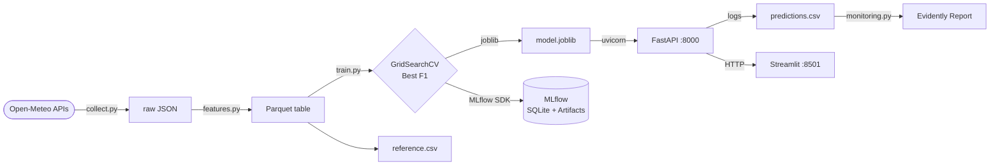

#  Riyadh Air Quality MLOps

Predicts whether PM2.5 air pollution in Riyadh will exceed 150 µg/m³ during the **next hour**.  
Built as a complete MLOps project — from raw API data to a live prediction service with drift monitoring.

---

##  Quick Start

**Requirements:** Python 3.13, [uv](https://docs.astral.sh/uv/), Docker + Docker Compose

### Local

```bash
git clone git clone https://github.com/OmarAbdullahQ/air-quality-mlops.git
cd air-quality-mlops
uv sync

# 1. Collect data (last 182 days, Riyadh)
uv run python -m air_quality.collect

# 2. Build feature table
uv run python -m air_quality.features

# 3. Start MLflow tracking server
uv run mlflow server --host 0.0.0.0 --port 5000 \
  --backend-store-uri sqlite:///mlflow.db \
  --default-artifact-root ./mlartifacts

# 4. Train all models (grid search + MLflow logging)
uv run python -m air_quality.train

# 5. Serve the API
uv run uvicorn app.api.main:app --host 0.0.0.0 --port 8000

# 6. Run the frontend
uv run streamlit run app/frontend/app.py

# 7. Generate drift report (after making some predictions)
uv run python -m air_quality.monitoring

# 8. Run tests
uv run pytest tests/
```

### Docker

Training must be run locally first to produce `models/model.joblib`.

```bash
docker compose up --build        # start API + frontend + MLflow
docker compose up --build -d     # detached
docker compose down              # stop
```

| Service | URL |
|---|---|
| FastAPI | http://localhost:8000 |
| Streamlit | http://localhost:8501 |
| MLflow | http://localhost:5000 |

---


##  Project Architecture



| Step | Script | Output |
|---|---|---|
| Data Collection | `src/air_quality/collect.py` | `data/raw/air_quality.json` |
| Feature Engineering | `src/air_quality/features.py` | `data/processed/model_table.parquet` |
| Hyperparameter Search | `train.py::run_grid_search()` | Console output |
| Training & Selection | `train.py::main()` | `models/model.joblib` |
| Experiment Tracking | MLflow SDK in `train.py` | MLflow runs |
| Prediction API | `app/api/main.py` | REST responses + prediction log |
| Frontend | `app/frontend/app.py` | Streamlit UI |
| Drift Monitoring | `src/air_quality/monitoring.py` | `reports/monitoring.html` |

---

##  Tech Stack

| Category | Technology |
|---|---|
| Language | Python 3.13 |
| Machine Learning | scikit-learn 1.9 |
| Data Processing | pandas 2.3, NumPy 2.5, PyArrow 24 |
| Backend | FastAPI 0.140, Uvicorn, Pydantic v2 |
| Frontend | Streamlit 1.60 |
| Experiment Tracking | MLflow 3.14 |
| Monitoring | Evidently 0.7 |
| Containerisation | Docker, Docker Compose |
| Dependency Management | uv + `uv.lock` |
| Testing / Linting | pytest 9.1, Ruff 0.16 |

---

##  Repository Structure

```
air-quality-mlops/
├── app/
│   ├── api/
│   │   └── main.py              # FastAPI app — /predict, /health, /model-info
│   └── frontend/
│       └── app.py               # Streamlit prediction UI
├── src/
│   └── air_quality/
│       ├── collect.py           # Fetches raw data from Open-Meteo APIs
│       ├── features.py          # Builds the model-ready parquet table
│       ├── train.py             # GridSearchCV + multi-model training + MLflow logging
│       └── monitoring.py        # Generates Evidently drift report
├── tests/
│   ├── test_api.py              # FastAPI health and validation tests
│   └── test_features.py        # (placeholder)
├── data/
│   ├── raw/                     # air_quality.json (gitignored)
│   ├── processed/               # model_table.parquet (gitignored)
│   └── monitoring/              # reference.csv + predictions.csv (gitignored)
├── models/
│   └── model.joblib             # Serialised best pipeline + threshold
├── reports/
│   └── monitoring.html          # Evidently HTML drift report
├── Dockerfile.api               # API container image
├── Dockerfile.frontend          # Frontend container image
├── docker-compose.yml           # Three-service orchestration
├── pyproject.toml               # Project metadata and dependencies
├── uv.lock                      # Locked dependency tree
├── .python-version              # Pins Python 3.13
└── evaluation.md                # Recorded test-set evaluation results
```

---

##  Dataset

Data is pulled from the [Open-Meteo](https://open-meteo.com/) Air Quality and Weather Archive APIs — no account or API key needed.

| Property | Value |
|---|---|
| Location | Riyadh, Saudi Arabia (24.7136, 46.6753) |
| Collection window | Rolling 182-day window, ending 5 days before today |
| Timezone | Asia/Riyadh |
| Granularity | Hourly |
| Target | `high_pollution_next_hour` — 1 if next-hour PM2.5 > 150 µg/m³ |

Raw variables: `pm2_5`, `pm10` (air quality) + `temperature_2m`, `relative_humidity_2m`, `wind_speed_10m` (weather archive).

**Preprocessing:** air and weather tables are inner-joined on timestamp, duplicate timestamps are dropped, then rows with any NaN in features or the target are removed.

**Split (chronological, no shuffling):** 70 % train → 15 % validation → 15 % test.

---

##  Machine Learning Pipeline

Each candidate model is wrapped in the same sklearn `Pipeline`:

```
SimpleImputer(median) → StandardScaler → Classifier
```

**Features used (10 total):**

| Feature | Description |
|---|---|
| `pm2_5`, `pm10` | Current pollutant readings |
| `temperature_2m`, `relative_humidity_2m`, `wind_speed_10m` | Meteorological conditions |
| `hour`, `day_of_week` | Time-of-day and day-of-week signals |
| `pm2_5_lag_1`, `pm2_5_lag_3` | PM2.5 one and three hours ago |
| `pm2_5_rolling_mean_6` | 6-hour rolling mean of PM2.5 (lag-1 based, no leakage) |

Classification threshold is fixed at **0.60** — applied consistently during evaluation and in the API.  
The model with the highest **validation F1** is saved to `models/model.joblib`.

---

##  Hyperparameter Search

`run_grid_search()` uses `GridSearchCV` with a `PredefinedSplit` that exactly mirrors the chronological train/validation boundary, scored on F1.

| Model | Parameters searched |
|---|---|
| Logistic Regression | `C` ∈ {0.01, 0.1, 1.0, 10.0}; `solver` ∈ {lbfgs, liblinear} |
| Random Forest | `n_estimators` ∈ {100, 250, 500}; `max_depth` ∈ {5, 10, 20, None}; `min_samples_leaf` ∈ {1, 5, 20} |
| Decision Tree | `max_depth` ∈ {3, 5, 10, None}; `min_samples_leaf` ∈ {1, 10, 50}; `criterion` ∈ {gini, entropy} |
| KNN | `n_neighbors` ∈ {3, 7, 15, 31}; `weights` ∈ {uniform, distance}; `p` ∈ {1, 2} |

Grid search results are printed to console. The final `main()` run uses the best-found settings and logs everything to MLflow.

---


##  MLflow

Experiment name: **`riyadh-air-quality`**  
UI: **http://localhost:5000**

Each run logs: `model` name, `threshold` (params) + `validation_f1`, `validation_recall`, `validation_roc_auc` (metrics) + the full sklearn Pipeline serialised with cloudpickle.

Backend store: SQLite (`mlflow.db`). Artifacts: `mlartifacts/` locally, named Docker volume in containers.

---

##  API

Base URL: `http://localhost:8000` · Docs: `http://localhost:8000/docs`

| Method | Endpoint | Description |
|---|---|---|
| `GET` | `/health` | Liveness check — returns `{"status": "ok", "model_loaded": true}` |
| `GET` | `/model-info` | Returns `{"version": "1.0.0", "threshold": 0.6}` |
| `POST` | `/predict` | Returns next-hour pollution forecast |

**`POST /predict` — request body**

```json
{
  "pm2_5": 25.0, "pm10": 60.0, "temperature_2m": 32.0,
  "relative_humidity_2m": 25.0, "wind_speed_10m": 12.0,
  "hour": 14, "day_of_week": 2,
  "pm2_5_lag_1": 24.0, "pm2_5_lag_3": 22.0, "pm2_5_rolling_mean_6": 23.0
}
```

**Response**

```json
{
  "request_id": "3fa85f64-...",
  "prediction": 0,
  "probability": 0.12,
  "risk_level": "normal",
  "model_version": "1.0.0"
}
```

Every call is appended to `data/monitoring/predictions.csv` for drift analysis.

---

##  Frontend

Streamlit app at **http://localhost:8501**.

The form takes current sensor readings (PM2.5, PM10, temperature, humidity, wind speed, lag features, hour, day-of-week) and POSTs them to `/predict`. Results show the probability, risk level (`HIGH` / `NORMAL`), and a colour-coded banner. A health indicator at the bottom polls `/health` on page load.

`API_URL` defaults to `http://localhost:8000`; Docker Compose overrides it to `http://api:8000`.

---

##  Docker

Three services defined in `docker-compose.yml`:

| Service | Image | Port |
|---|---|---|
| `api` | `Dockerfile.api` (python:3.12-slim + uv) | 8000 |
| `frontend` | `Dockerfile.frontend` (python:3.12-slim + uv) | 8501 |
| `mlflow` | `ghcr.io/mlflow/mlflow:latest` | 5000 |

**Volumes:** `./models` is mounted read-only into `api`; `monitoring_data` persists the prediction log; `mlflow_data` persists the SQLite DB and artifacts.

**Startup order:** `frontend` waits for `api` to pass its `/health` check (15 s interval, 5 retries) before starting.

> **Note:** the `version` key in `docker-compose.yml` is obsolete in recent Docker Compose versions and can be removed.

---

##  Generated Outputs

| Path | Description |
|---|---|
| `data/raw/air_quality.json` | Raw Open-Meteo API response |
| `data/processed/model_table.parquet` | Engineered feature table |
| `models/model.joblib` | Best pipeline + threshold dict |
| `data/monitoring/reference.csv` | Test-split baseline for drift monitoring |
| `data/monitoring/predictions.csv` | Live prediction log from the API |
| `mlflow.db` | MLflow experiment metadata |
| `mlartifacts/` | Serialised model artifacts |
| `reports/monitoring.html` | Evidently drift report |

---

##  License

No license specified. All rights reserved by the author.

---

##  Authors

Omar Abdullah
Badr Al Zahrani
Emad Almuhaysin
Omar Saleh


